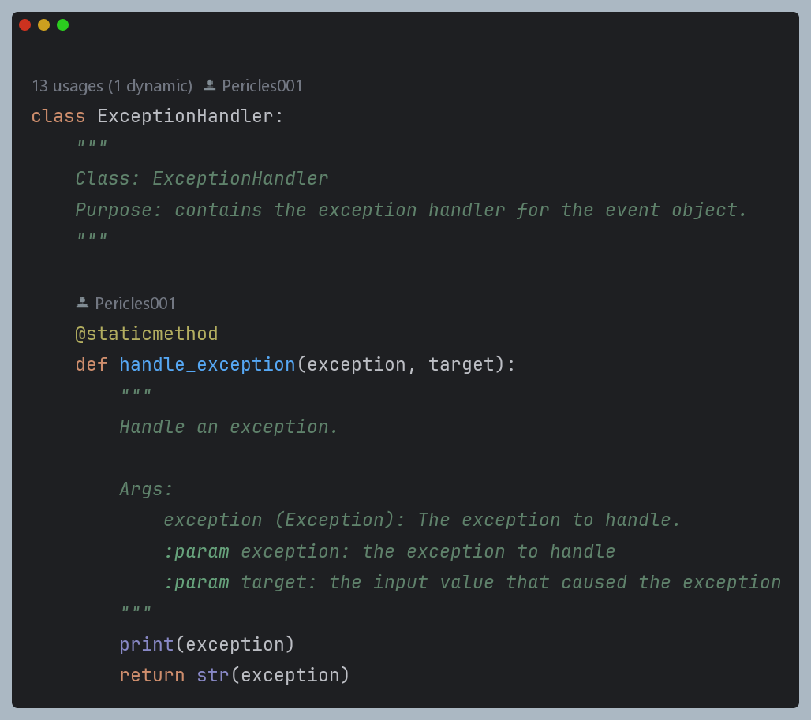
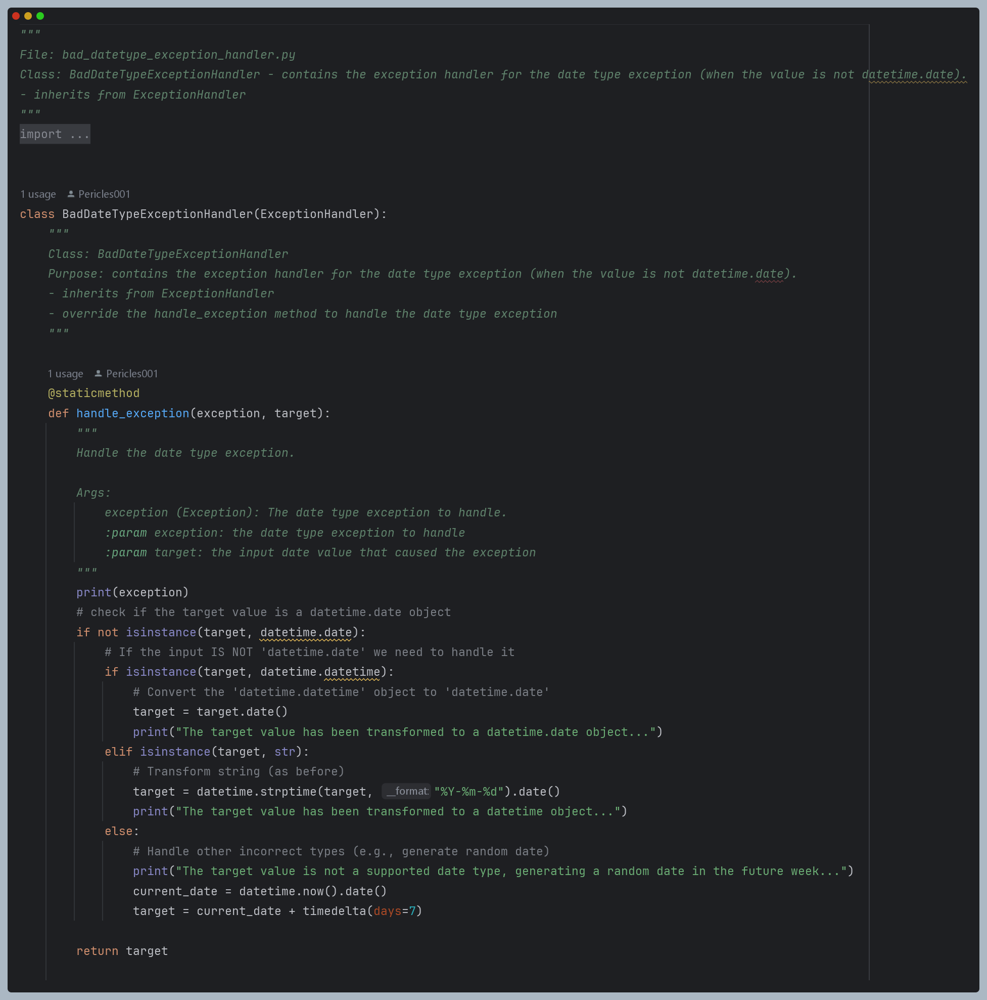

# eventScheduler
Repository created to store the event scheduler project.


## Project Description

The event scheduler is a project that allows users to create, update, delete and list events. The project is built using the object oriented paradigm in Python.


### Requirements

#### Functional Requirements

_Event_ : an event is defined by a title, a date and an optional description. 


- Event creation : Users should be able to create events.
- Event update : Users should be able to update events.
- Event deletion : Users should be able to delete events.
- Event listing : Users should be able to list events.
- List order : Events should be listed in chronological order based on their date.


#### Non-Functional Requirements

- The deliverable is either a script or an interactive application.
- The project should be built using the object oriented paradigm.
- The project should be documented in a README.md file.


### Assumptions

- Each user should be able to assess unique events based on their interaction with the system.
- As a user, it is mandatory to have a unique username, password and session in the system.
- The system should be able to store the events created by the user in a persistent manner.
- A file database is necessary to handle the data persistence feature in the system.
- A user might not be trust on their inputs so the system needs to handle the input validation.

#### User attributes

_User_ : a user is defined by a username, a password, an email, a fullname, a status and events.


- Username : a unique identifier for the user.
- Password : a secret key to access the system.
- Email : a contact information for the user.
- Fullname : the user's name.
- Status : the user's status in the system.
- Events : the events created by the user in a list format.

#### Security

<p align="center">
  
</p>

- The system security process is handled with the use of sha256 hashing algorithm.
- User's password is hashed before being stored in the database.

#### Relationships


- A user can create multiple events.
- An event is created by a user.
- An event can be updated by the user who created it.
- An event can be deleted by the user who created it.
- An event can be listed by the user who created it.
- All events created by a user can be listed by him only.

## Project Structure

### Architecture

The project architecture uses a folder structure which can be schematized as follow:

├── LICENSE

├── README.md

├── __init__.py

├── data

│   ├── in

│   │   ├── event_data.json

│   │   └── event_data.txt

│   └── out

│       ├── users.json

│       └── users.txt

├── main.py

├── requirements.txt

└── src

    ├── __init__.py

    ├── auth

    │   ├── __init__.py

    │   └── auth_user.py

    ├── exception

    │   ├── __init__.py

    │   ├── bad_datetype_exception_handler.py

    │   ├── bad_titletype_exception_handler.py

    │   ├── bad_type_description_exception_handler.py

    │   ├── empty_date_exception_handler.py

    │   ├── empty_description_exception_handler.py

    │   ├── empty_title_exception_handler.py

    │   ├── exception_handler.py

    │   └── past_date_exception_handler.py

    ├── io

    │   ├── __init__.py

    │   ├── builder.py

    │   ├── flat_builder.py

    │   ├── json_builder.py

    │   └── user_save.py

    ├── model

    │   ├── __init__.py

    │   ├── event.py

    │   └── user.py

    ├── repository

    │   ├── __init__.py

    │   └── repository.py

    ├── service

    │   ├── __init__.py

    │   ├── event_services.py

    │   └── users_service.py

    ├── test

    │   ├── __init__.py

    │   ├── data

    │   │   └── out

    │   │       └── users.txt

    │   ├── test_event.py

    │   ├── test_event_repository.py

    │   ├── test_flat_builder.py

    │   ├── test_json_builder.py

    │   ├── test_load_user.py

    │   ├── test_save_user.py

    │   ├── test_update_user_details.py

    │   ├── test_user.py

    │   └── test_user_service.py

    ├── ui

    │   ├── __init__.py

    │   └── event_scheduler_ui.py

    └── utils

        ├── __init__.py

        └── utils.py

### Modules

the modules are structured as a package in the src folder. 
Each module is defined by a set of classes and functions that are used to implement the project requirements.

#### Auth

#### Exception

#### IO

#### Model

#### Repository

#### Service

#### Test

#### UI

The module ui contains the user interface and the main functions of the application.

- `event_scheduler_ui.py` : contains the main functions of the application.


    register_user() [ function ] : registers a user in the system.
    - takes the username, password, email and fullname as input.
    - define a value of 0 for the status of the user.
    - checks if user inputs are empty.
    - In case of empty inputs, the function alerts user and asks for new inputs.
    - In case of non-empty inputs, the function encrypts the password and saves the user in the database.

    login_user() [ function ] : logs a user in the system.
    - takes the username and password as input.
    - checks if user inputs are empty.
    - In case of empty inputs, the function alerts user and asks for new inputs.
    - In case of non-empty inputs, the function checks if the user exists in the database.
    - In case of non-existing user, the function alerts the user and asks for new inputs.
    - In case of existing user, the function checks if the password is correct.
    - In case of incorrect password, the function alerts the user and asks for new inputs.
    - In case of correct password, the function logs the user in the system.

    submenu_update_account() [ function ] : function that contains the submenu dedicated to update a user's account.
    - takes the logged username as base reference.
    - asks the user to choose the field to update.
    - Check for input validity.
    - In case of invalid input, the function alerts the user and asks for new inputs.
    - In case of valid input, the function updates the user's account.
    
    submenu_delete_account() [ function ] : function that contains the submenu dedicated to delete a user's account.
    - takes the logged username as base reference.
    - asks the user to confirm the deletion.
    - In case of confirmation, the function deletes the user's account.

    submenu_manage_account() [ function ] : function that contains the submenu dedicated to manage a user's account.
    - takes the logged username as base reference.
    - asks the user to choose the action to perform.
    - Check for input validity.
    - In case of invalid input, the function alerts the user and asks for new inputs.
    - In case of valid input, the function performs the action chosen by the user.
    - In case of exit, the function logs the user out of the system.

    main_menu() [ function ] : function that contains the main menu of the application.
    - asks the user to choose the action to perform.
    - Switch the submenu depending on the user's choice.
    - In case of invalid input from the user, the function alerts the user and asks for new inputs.
    - In case of exit, the function logs the user out of the system.

    return_to_main_menu() [ function ] : function that asks the user if he wants to return to the main menu.
    - asks the user if he wants to return to the main menu.
    - In case of confirmation, the function returns to the main menu.
    - In case of exit, the function logs the user out of the system.


    auth_menu() [ function ] : function that contains the authentication menu of the application.
    - asks the user to choose the action to perform.
    - Switch the submenu depending on the user's choice.
    - In case of invalid input from the user, the function alerts the user and asks for new inputs.
    - In case of exit, the function logs the user out of the system.


    submenu_create_event_category() [ function ] : function that contains the submenu dedicated to create an event category.
    - asks the user to choose the action to perform.
    - Check for input validity.
    - Switch the content to a submenu depending on the user choice to create an event.

    submenu_create_event_manual() [ function ] : function that contains the submenu dedicated to create an event manually.
    - asks the user to choose the action to perform.
    - Ask the user to input the details of the event to create.
    - Check for input validity.
    - In case of invalid input, the function alerts the user and asks for new inputs.
    - In case of valid input, the function creates the event.

    submenu_create_event_file() [ function ] : function that contains the submenu dedicated to create an event from a file.
    - asks the user to choose the action to perform.
    - Ask the user to choose between json option and flat file option.
    - Check for input validity.
    - In case of invalid input, the function alerts the user and asks for new inputs.
    - Depending on the user choice, the function calls the corresponding subfunction.

    submenu_create_event_json() [ function ] : function that contains the submenu dedicated to create an event from a json file.
    - asks the user to choose the action to perform.
    - Ask the user to input the path of the json file.
    - Check for input validity.
    - In case of invalid input, the function alerts the user and asks for new inputs.
    - In case of valid input, the function creates the event based on the content in the json file.

    submenu_create_event_flat() [ function ] : function that contains the submenu dedicated to create an event from a flat file.
    - asks the user to choose the action to perform.
    - Ask the user to input the path of the flat file.
    - Check for input validity.
    - In case of invalid input, the function alerts the user and asks for new inputs.
    - In case of valid input, the function creates the event based on the content in the flat file.
    - In case of exit, the function returns to the previous menu.


    submenu_view_event() [ function ] : function that contains the submenu dedicated to decide how to view events.
    - asks the user to choose the action to perform.
    - Check for input validity.
    - Switch the content to a submenu depending on the user choice to view events.
    

    submenu_view_specific_event() [ function ] : function that contains the submenu dedicated to view a specific event.
    - asks the user to choose the action to perform.
    - Checks for input validity.
    - In case of invalid input, the function alerts the user and asks for new inputs.
    - In case of valid input, the function displays the event details.

    submenu_update_event() [ function ] : function that contains the submenu dedicated to update an event.
    - asks the user to choose the action to perform.
    - Check for input validity.
    - In case the user chooses to update an event, the function asks the user to input the event desired updates.
    - In case of invalid input, the function alerts the user and asks for new inputs.
    - In case of valid input, the function updates the event.

    submenu_delete_event() [ function ] : function that contains the submenu dedicated to delete an event.
    - asks the user to choose the action to perform.
    - In case the user chooses to delete an event, the function asks the user to input the event title for the event to delete.
    - Check for input validity.
    - In case of invalid input, the function alerts the user and asks for new inputs.
    - Check if the event exists.
    - In case of non-existing event, the function alerts the user and asks for new inputs.
    - In case of existing event, the function deletes the function from the user's functions and delete from the file.

    submenu_logout() [ function ] : function that contains the submenu dedicated to logout the user.
    - asks the user to confirm the logout.
    - In case of confirmation, the function logs the user out of the system.

     


- `__init__.py` : the module initializer.

#### Utils

The module contains utility functions that are used across the project.

- `utils.py` : contains utility functions that are used across the project.


    create_log_file_if_not_exists() [ function ] : creates a log file if it does not exist. returns the file name.

    write_to_daily_log_file(message, log_name) [ function ] : writes a message to a log file. does not return anything.

    get_current_time() [ function ] : returns the current time.

    encrypt_password(password) [ function ] : encrypts a password using the sha256 hashing algorithm. returns the encrypted password.


- `__init__.py` : the module initializer.


### Design Patterns

The development stage of the project has required the use of different design patterns to ensure the project 
requirements are met. The design patterns used in the project are :

*Factory pattern* : In practice, a super class has attributes, that subclasses inherit and override so that they can be
called later depending on the requirement.


- Example: exception handler



- Example: exception handler subclass - bad datetype




### Diagrams

#### Use Case Diagram


#### Class Diagram

#### Sequence Diagram

## Technologies

The project is built using the following technologies:

### Language

- Python 3.11

### Libraries

- json
- sys
- os
- datetime
- hashlib

### Frameworks

- No frameworks used

## How to run the project

### Prerequisites

The prerequisites for using the system are :

- Python 3.7 or higher.
- Git installed on local machine.
- Usage of linux operating system is recommended.
- In case of windows, the usage of git bash is recommended.
- If pycharm IDE is available on the local machine, it is recommended to use it.

### Installation

1. Clone the repository:

```bash
git clone https://github.com/Pericles001/eventScheduler.git
```


### Running

The steps to follow in order to run the project : 


1. Navigate to the project folder:

```bash
cd eventScheduler
```

2. Run the main.py file:

```bash
python main.py
```

_Note_ : Depending on your system, you might need to use `python3` instead of `python`.


## Authors

[Pericles001](https:www.github.com/Pericles001)

## Acknowledgements 

The project has been built with the help of the following resources:

* stackoverflow : [typeerror, string indices must be integers](https://stackoverflow.com/questions/6077675/why-am-i-seeing-typeerror-string-indices-must-be-integers)
* geeksforgeeks : [Usage of getpass to hide user input](https://www.geeksforgeeks.org/getpass-and-getuser-in-python-password-without-echo/)
* chatgpt prompts : [Example of good project structure in object oriented paradigm]()
* realpython : [Python Project documentation](https://realpython.com/python-project-documentation-with-mkdocs/)

## License

License used for the repository is: Apache License 2.0
