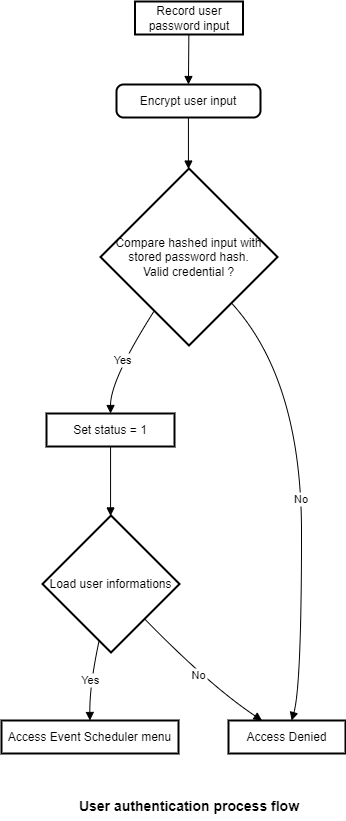
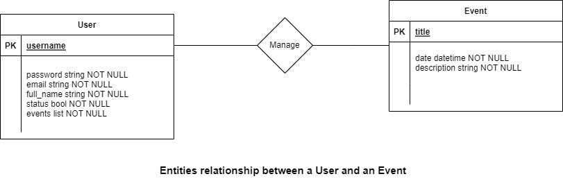

# eventScheduler
Repository created to store the event scheduler project.

## Project Description

The event scheduler is a project that allows users to create, update, delete and list events. The project is built using the object oriented paradigm in Python.

### Requirements

#### Functional Requirements

_Event_ : an event is defined by a title, a date and an optional description. 

- Event creation : Users should be able to create events.
- Event update : Users should be able to update events.
- Event deletion : Users should be able to delete events.
- Event listing : Users should be able to list events.
- List order : Events should be listed in chronological order based on their date.

#### Non-Functional Requirements

- The deliverable is either a script or an interactive application.
- The project should be built using the object oriented paradigm.
- The project should be documented in a README.md file.

### Assumptions

- Each user should be able to assess unique events based on their interaction with the system.
- As a user, it is mandatory to have a unique username, password and session in the system.
- The system should be able to store the events created by the user in a persistent manner.
- A file database is necessary to handle the data persistence feature in the system.
- A user might not be trust on their inputs so the system needs to handle the input validation.

#### User attributes

_User_ : a user is defined by a username, a password, an email, a fullname, a status and events.

- Username : a unique identifier for the user.
- Password : a secret key to access the system.
- Email : a contact information for the user.
- Fullname : the user's name.
- Status : the user's status in the system.
- Events : the events created by the user in a list format.

#### Security

  

- The system security process is handled with the use of sha256 hashing algorithm.
- User's password is hashed before being stored in the database.

#### Relationships

- A user can create multiple events.
- An event is created by a user.
- An event can be updated by the user who created it.
- An event can be deleted by the user who created it.
- An event can be listed by the user who created it.
- All events created by a user can be listed by him only.

## Project Structure

### Architecture

### Design Patterns

### Diagrams

#### Use Case Diagram

#### Class Diagram

#### Sequence Diagram

## Technologies

### Language

### Libraries

### Frameworks

## How to run the project

### Prerequisites

### Installation

### Running

## Authors

[Pericles001](https:www.github.com/Pericles001)

## Acknowledgements 

The project has been built with the help of the following resources:

* stackoverflow : [typeerror, string indices must be integers](https://stackoverflow.com/questions/6077675/why-am-i-seeing-typeerror-string-indices-must-be-integers)
* geeksforgeeks : [Usage of getpass to hide user input](https://www.geeksforgeeks.org/getpass-and-getuser-in-python-password-without-echo/)
* chatgpt prompts : [Example of good project structure in object oriented paradigm]()
* realpython : [Python Project documentation](https://realpython.com/python-project-documentation-with-mkdocs/)

## License

License used for the repository is: Apache License 2.0
